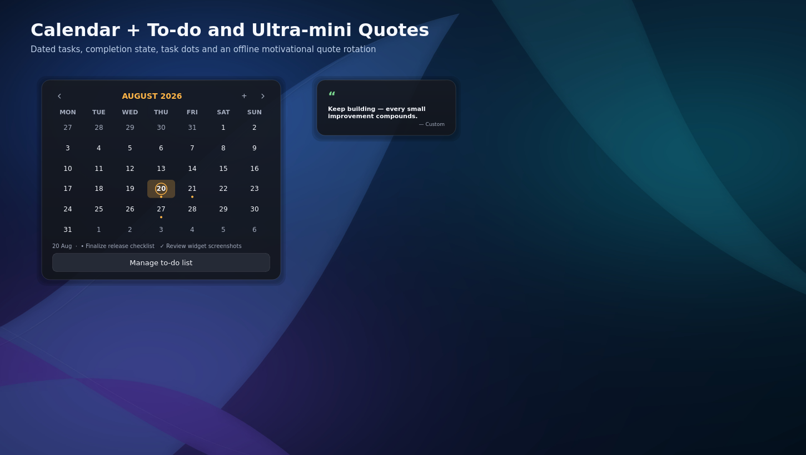
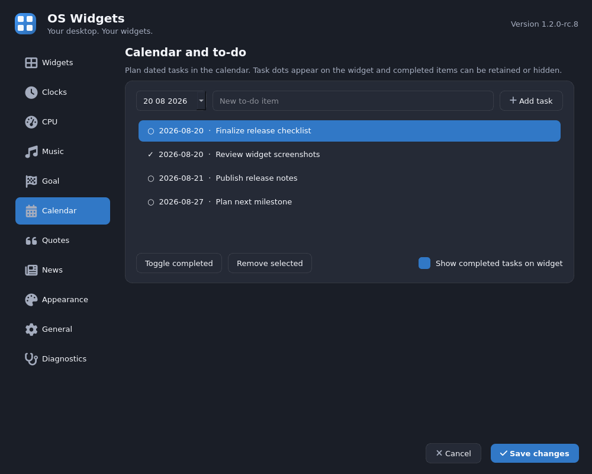

# OS Widgets

**Your desktop. Your widgets.**

OS Widgets is a polished, lightweight Windows desktop widget application delivered as a single Python file. It provides clocks, system monitoring, news, local music controls, a goal countdown, a calendar with dated to-dos, and ultra-mini motivational quotes.


## Highlights

- Four customizable analog or digital world clocks
- CPU, GPU, RAM, Wi-Fi, disk-partition, and battery monitoring
- Article-specific news image slider with offline handling
- Local music player with playlist, seek, volume, and optional cover artwork
- Goal countdown with days, hours, minutes, seconds, and optional artwork
- Month calendar with task dots, date selection, and persistent to-do items
- Ultra-mini offline motivational-quotes widget with custom quote support
- Square or rounded styling, transparency, colors, and four size presets
- Optional performance alerts with repeating warnings and custom sounds
- Windows Diagnostics page and startup integration
- Balanced and Eco performance modes

Music, Goal, Calendar, and Quotes are disabled by default and create no widget or timer until enabled.

## Requirements

- Windows 10 or Windows 11
- Python 3.10 or newer

Install dependencies:

```powershell
py -m pip install -r requirements.txt
```

## Run

```powershell
pyw os_widgets.py
```

For console diagnostics during development:

```powershell
py os_widgets.py
```

## Image recommendations

- Music Player cover: **600 × 600 px**, square 1:1
- Goal Countdown image: **1200 × 800 px**, landscape 3:2

## Motivational quotes

The built-in quote list is also available in [`motivational-quotes.txt`](motivational-quotes.txt). Quotes remain bundled inside `os_widgets.py`, so the application does not need this text file at runtime.

## Resource-conscious behavior

- Music playback is signal-driven and uses no polling timer.
- Calendar checks the current day only once per hour with a very-coarse timer.
- Quotes rotate with one configurable very-coarse timer and make no network requests.
- Goal updates once per second only when seconds are enabled; otherwise, once per minute.
- Optional widgets are not instantiated while disabled.

## Validation status

RC8 passed **14/14 automated functional checks** in the Linux Qt offscreen test harness. The calendar task workflow, task persistence, quote rotation, custom quotes, presets, and timer behavior were exercised. See [`docs/test-results/RC8-TEST-RESULTS.json`](docs/test-results/RC8-TEST-RESULTS.json).

Native Windows multimedia output and Windows-only APIs still require final validation on physical Windows hardware before a production release.

## Project structure

```text
os_widgets.py                    Single-file application
motivational-quotes.txt          Human-readable built-in quote list
requirements.txt                 Python dependencies
docs/screenshots/                RC8 visual evidence
docs/test-results/               Automated test evidence
```

## Screenshots

### Calendar and ultra-mini quotes



### Calendar task management



## License

No open-source license has been selected yet. Copyright rights remain with the repository owner unless a license is added.
