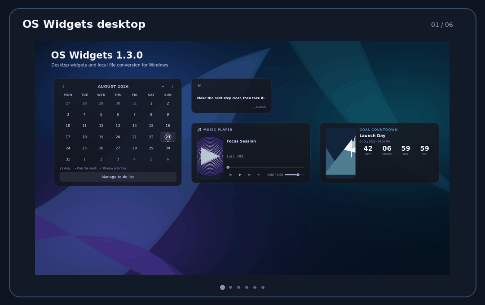
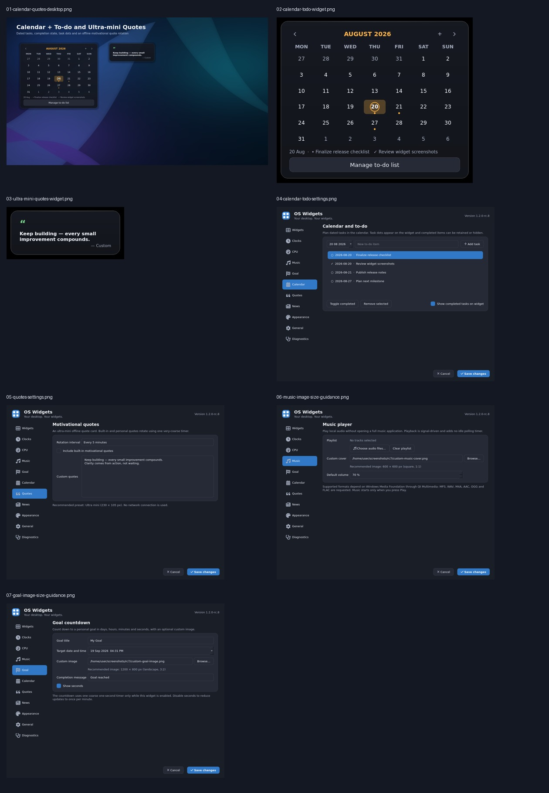
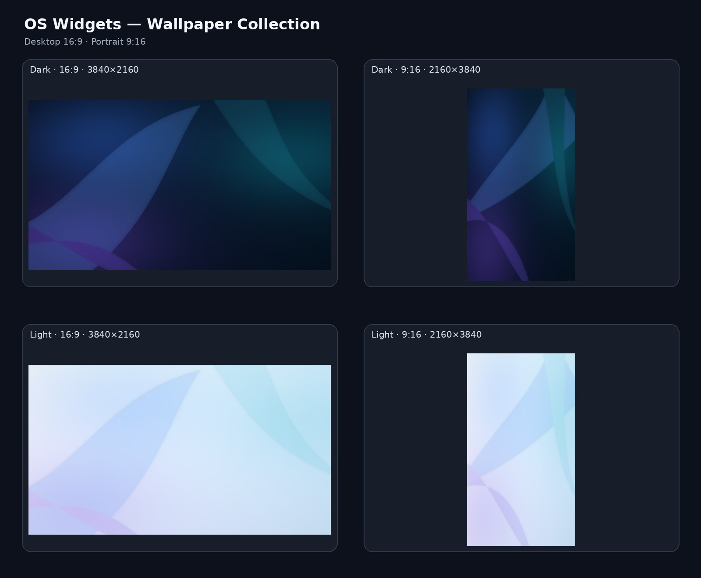

<div align="center">
  
</div>

<div align="center">

[](https://github.com/Comet-Suite/os-widgets-windows/actions/workflows/windows-release.yml)
[](https://github.com/Comet-Suite/os-widgets-windows/actions/runs/32405047343)
[](https://github.com/Comet-Suite/os-widgets-windows/releases)
[](#system-requirements)
[](#run-from-source)

A polished, resource-conscious desktop widget suite for Windows—delivered as one Python application file, with professional installer and portable builds.

[**Download for Windows**](https://github.com/Comet-Suite/os-widgets-windows/releases) · [Wallpapers](#official-wallpapers) · [Features](#features) · [Run from source](#run-from-source) · [Report an issue](https://github.com/Comet-Suite/os-widgets-windows/issues)

</div>

---

## Screenshot showcase

<div align="center">
  
  <br>
  <sub>Animated product tour · Calendar · To-do · Quotes · Music Player · Goal Countdown</sub>
</div>

<details>
<summary><strong>Open the complete static RC8 screenshot sheet</strong></summary>
<br>

</details>

## Official wallpapers

<div align="center">
  
</div>

The repository includes matching **dark and light wallpapers** for desktop and portrait displays.

| Theme | Desktop 4K · 3840 × 2160 | Portrait · 2160 × 3840 |
|---|---|---|
| **Dark** | [Download desktop](wallpapers/os-widgets-dark-16x9-4k.jpg) | [Download portrait](wallpapers/os-widgets-dark-9x16-portrait.jpg) |
| **Light** | [Download desktop](wallpapers/os-widgets-light-16x9-4k.jpg) | [Download portrait](wallpapers/os-widgets-light-9x16-portrait.jpg) |

[Open the complete wallpaper collection →](wallpapers/README.md)

## Why OS Widgets?

OS Widgets keeps useful information on your desktop without turning into a second full-screen dashboard. Every widget can be resized, styled, locked, hidden, or disabled. Optional widgets are instantiated only when you enable them.

- **Native desktop experience** — frameless, movable widgets designed for Windows
- **Focused and private** — local music and offline quotes; no account required
- **Resource-conscious** — shared maintenance timing, coarse refresh intervals, and Eco mode
- **Customizable** — four size presets, transparency, color controls, square or rounded corners
- **Honest diagnostics** — system readings and Windows integration checks in one place

## Features

| Widget | Capabilities |
|---|---|
| **World clocks ×4** | Analog or digital mode, time zones, 12/24-hour time, optional seconds and date |
| **System monitor** | CPU, GPU, RAM, Wi-Fi, all detected disk partitions, temperature where available, and laptop battery state |
| **News** | Article-image headline slider, categories, custom RSS, cache, and an explicit offline state |
| **Music Player** | Local playlist, transport controls, seeking, volume, and custom square cover artwork |
| **Goal Countdown** | Days, hours, minutes, seconds, custom message, and optional landscape artwork |
| **Calendar + To-do** | Month navigation, today/selection highlighting, task dots, dated tasks, and completion state |
| **Motivational Quotes** | 230 × 105 ultra-mini preset, bundled offline quotes, custom lines, and slow rotation |

Additional application features include performance alerts, custom warning sounds, repeating warning controls, startup integration, appearance themes, per-widget opacity, desktop placement options, and a Windows Diagnostics page.

## Download for Windows

Go to the [**Releases page**](https://github.com/Comet-Suite/os-widgets-windows/releases) and choose one of these x64 packages:

| RC8 release check | Status |
|---|---|
| Windows x64 build | **✅ Passing** |
| Installer and portable assets | **✅ Published** |
| SHA-256 verification | **✅ Passed** |
| RC8 functional checks | **✅ 14/14 passed** |

[View the successful Windows build →](https://github.com/Comet-Suite/os-widgets-windows/actions/runs/32405047343)

### Installer — recommended

`OS-Widgets-1.2.0-rc.8-Windows-x64-Setup.exe`

Installs OS Widgets for the current user, adds Start Menu entries, and offers optional desktop and startup shortcuts. Administrator rights are not normally required.

### Portable package

`OS-Widgets-1.2.0-rc.8-Windows-x64-Portable.zip`

Extract the entire archive, then run `OS-Widgets.exe`. No installation is required.

> **Release-candidate notice:** RC8 is a pre-release. The package is not code-signed, so Microsoft Defender SmartScreen may display a reputation warning. Verify the SHA-256 value from `SHA256SUMS.txt` before running it.

## System requirements

- Windows 10 or Windows 11, 64-bit
- Approximately 250 MB free disk space for the packaged build
- Internet access only for News; all other core widgets work locally
- Audio hardware and Windows Media Foundation codecs for Music Player output

## Run from source

Requires Python 3.10 or newer.

```powershell
# Clone the project
git clone https://github.com/Comet-Suite/os-widgets-windows.git
cd os-widgets-windows

# Optional but recommended: create a virtual environment
py -m venv .venv
.\.venv\Scripts\Activate.ps1

# Install and launch
py -m pip install -r requirements.txt
pyw os_widgets.py
```

For console diagnostics during development:

```powershell
py os_widgets.py
```

## First-time setup

1. Launch OS Widgets.
2. Open the tray icon and select **Settings**.
3. Enable only the widgets you want on the **Widgets** page.
4. Drag widgets by their header area and resize them from their edges.
5. Right-click a widget for size, opacity, locking, refresh, and placement options.
6. Use **General → Performance mode → Eco** for slower monitoring intervals.

Music, Goal, Calendar, and Quotes are disabled by default and consume no widget timer or UI resources until enabled.

## Recommended image dimensions

| Feature | Recommended image | Aspect ratio |
|---|---:|---:|
| Music Player cover | **600 × 600 px** | 1:1 square |
| Goal Countdown image | **1200 × 800 px** | 3:2 landscape |

JPG and PNG are recommended. The application crops images to fill their card while preserving aspect ratio.

## Privacy and network behavior

- No OS Widgets account is required.
- Quotes are bundled locally and never require network access.
- Music Player opens only local files selected by you.
- Goal and calendar data are stored locally through Qt application settings.
- News uses the configured RSS source and downloads article metadata/images when enabled.
- OS Widgets does not include analytics or advertising code.

## Performance design

- Music playback is signal-driven and uses no polling timer.
- Calendar refreshes current-day state once per hour with a very-coarse timer.
- Quotes use one configurable very-coarse rotation timer.
- Goal updates once per second only when seconds are shown; otherwise, once per minute.
- Hardware probes use balanced intervals, with slower options available in Eco mode.
- Optional Music, Goal, Calendar, and Quotes widgets are not created while disabled.

## Motivational quote list

The bundled list is available in [`motivational-quotes.txt`](motivational-quotes.txt). The text file is provided for convenience; the executable keeps its built-in list inside `os_widgets.py` and does not depend on this file at runtime.

## Build the Windows packages

The repository includes a reproducible PyInstaller + Inno Setup pipeline.

```powershell
# Install Inno Setup 6 first, then run:
.\packaging\build-windows.ps1
```

The command creates these files under `release\`:

- Windows x64 installer
- Windows x64 portable ZIP
- SHA-256 checksum manifest

Tagged versions such as `v1.2.0-rc.8` run the same build on GitHub Actions and publish a GitHub pre-release automatically.

## Validation status

RC8 passed **14/14 automated functional checks** in the Qt offscreen harness, including calendar task persistence, task state changes, quote rotation, custom quotes, presets, and timer behavior. Evidence is available in [`docs/test-results/RC8-TEST-RESULTS.json`](docs/test-results/RC8-TEST-RESULTS.json).

Native Windows APIs and real multimedia output remain release-gating checks for the eventual stable build. Please report Windows-specific results through [GitHub Issues](https://github.com/Comet-Suite/os-widgets-windows/issues).

## Repository layout

```text
os_widgets.py                 Single-file application source
assets/                       Windows application icon
packaging/                    PyInstaller and Inno Setup definitions
.github/workflows/            Reproducible Windows release workflow
docs/screenshots/             Visual evidence
docs/test-results/            Automated test evidence
wallpapers/                    Dark/light desktop and portrait wallpapers
motivational-quotes.txt       Human-readable built-in quote list
```

## Contributing

Contributions are welcome. Read [`CONTRIBUTING.md`](CONTRIBUTING.md), keep the distributable application in `os_widgets.py`, and include screenshots plus resource-impact notes for UI changes.

## License

No open-source license has been selected. Unless a license is added, copyright and reuse rights remain with the repository owner.

---

<div align="center">
  <strong>OS Widgets</strong><br>
  <sub>Your desktop. Your widgets.</sub>
</div>
