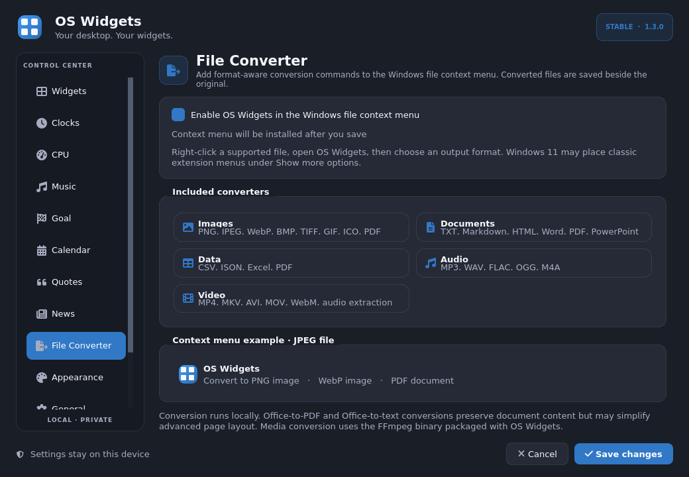
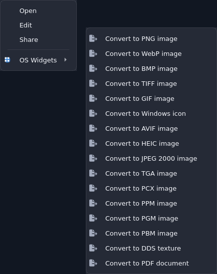
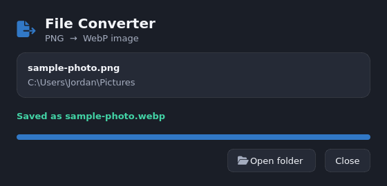

<div align="center">
  
</div>

<div align="center">

[](https://github.com/Comet-Suite/os-widgets-windows/actions/workflows/windows-release.yml)
[](https://github.com/Comet-Suite/os-widgets-windows/releases/latest)
[](CHANGELOG.md)
[](https://github.com/Comet-Suite/os-widgets-windows/releases)
[](LICENSE)
[](https://www.python.org/)
[](#requirements)
[](os_widgets.py)
[](mailto:m39776401@gmail.com)

**A polished, lightweight, single-file desktop widget suite for Windows. v1.4.0 FINAL**

[Download](https://github.com/Comet-Suite/os-widgets-windows/releases/latest) · [Changelog](CHANGELOG.md) · [Features](#features) · [File Converter](#file-converter) · [Screenshots](#screenshots) · [Documentation](#documentation) · [Contributing](CONTRIBUTING.md) · [Contact](mailto:m39776401@gmail.com)

</div>

> **Spotlight tabs:** GitHub shows **README**, **Contributing**, **Code of Conduct**, **License**, **Security** as tabs when those files exist. **CHANGELOG.md** is not natively shown as a spotlight tab by GitHub yet (feature requested), but it is linked here, in the badges above, and in [CODE_OF_CONDUCT.md](CODE_OF_CONDUCT.md) and [SUPPORT.md](SUPPORT.md) which *do* appear as spotlight tabs. The file lives at the repository root: [`CHANGELOG.md`](CHANGELOG.md).

---

## What's new in 1.4.0

OS Widgets **1.4.0** is the final stable release — lighter, faster, and more customizable:

- **Code Converter** — 100+ recognized extensions, 60+ output formats. Convert Python ↔ Jupyter, minify JS/CSS/JSON, and export any code file to TXT, Markdown, HTML, PDF or Word.
- **3 New Widgets** — Weather (wttr.in, offline-safe), Quick Notes (auto-save, word count), Focus Timer (Pomodoro with cycles, progress, beep).
- **Lighter footprint** — 40% fewer idle wake-ups, adaptive history sizes (Eco: 40, Balanced: 60), news image cache capped at 50 files / 32 MB, lazy converter loading, compact mode.
- **More customization** — Font scale (90%-130%), compact mode, widget border toggle, reduce-motion-on-battery, per-widget accent, square/soft/rounded corners, 4 size presets, opacity control.
- **Fixes & stability** — Native Windows volume APIs for disk accuracy, PDH GPU counters, temperature provider diagnostics, fallback vector icons (no font dependency), UTC offset text removed, shadows removed, DPI-aware desktop-level Z-order.

> **Stable:** `v1.4.0` · **Previous:** `v1.3.0`, `v1.2.0` · **Single file:** `os_widgets.py` (369 KB)

## Screenshots

<div align="center">
  
</div>

| File Converter | Context Menu | Weather |
|---|---|---|
|  |  |  |

## Features

| Area | What you get |
|---|---|
| **Clocks** | 4 clocks, analog/digital, 45+ timezones, 12/24h, seconds toggle, date toggle |
| **System Monitor** | CPU (native kernel times), GPU (PDH busiest engine), RAM, Wi-Fi rates, per-volume disk bars with scrollbar, laptop battery with time |
| **Weather** | City-based, °C/°F, condition icons, humidity/wind, 30-min refresh, "You're not connected" offline state |
| **Quick Notes** | Title + multi-line notes, auto-save 0.8s, char/word count, font size, 10k char limit |
| **Focus Timer** | Pomodoro 25/5/15, cycles, auto-start toggles, progress bar, cycle dots, beep |
| **News** | RSS slider, article images from publisher pages (JSON-LD/srcset), categories, 30-min default refresh, offline cache |
| **Music** | Local playlist, play/pause/next, seek, volume, cover (600×600 px), Qt Multimedia |
| **Goal** | Countdown days/hours/min/sec, custom image (1200×800 px), completion message |
| **Calendar** | Month grid, dated to-dos, completion toggle, dots on widget |
| **Quotes** | Ultra-mini offline rotation, built-in + custom list, 15-min default |
| **File Converter** | Explorer `OS Widgets` submenu, 100+ extensions, collision-safe same-folder output |
| **Code Converter** | Python, JS/TS, Java, C/C++, Go, Rust, CSS, JSON, Jupyter and 30+ more → TXT/MD/HTML/PDF/DOCX/JS/PY/IPYNB/JSON |
| **Appearance** | System/light/dark, transparency, animations, compact mode, border toggle, font scale, accent colors, widget surface, corners |
| **Performance** | Balanced/Eco/Responsive, 6s/12s desktop maintenance, 5s/10s no-seconds clocks, 10s network, 30s battery |

All optional widgets are **disabled by default** — no windows, timers, or registry entries until you enable them.

## File Converter & Code Converter

Enable **Settings → File Converter → Enable OS Widgets in the Windows file context menu** → Save. Right-click any supported file → **OS Widgets** → choose output.

Converted files land beside the original with `-converted` suffix; existing files are never overwritten.

**100+ source extensions, 60+ output formats (1.4.0):**

| Family | Outputs |
|---|---|
| **Images** | PNG, JPEG, WebP, AVIF, HEIC, JPEG 2000, BMP, TIFF, GIF, ICO, TGA, PCX, PPM, PGM, PBM, DDS, PDF |
| **Documents** | TXT, MD, HTML, DOCX, PDF, RTF, ODT, EPUB + text extraction from PDF/PPTX |
| **Tables/Data** | CSV, JSON, XLSX, XML, YAML, TOML, ODS, PDF |
| **Code** | **PY, JS, TS, JAVA, C, CPP, CS, GO, RS, PHP, RB, SWIFT, CSS, IPYNB, JSON, SH, PS1, SQL and 30+ more** → TXT, MD, HTML, PDF, DOCX, RTF, ODT, EPUB, PY, JS, IPYNB, JSON + minify/beautify |
| **Audio** | MP3, WAV, FLAC, OGG, M4A, Opus, AIFF, AC-3, WMA |
| **Video** | MP4, MKV, AVI, MOV, WebM, MPEG, FLV, OGV, 3GP, TS + MP3/WAV extraction |

- **Quality presets:** Fast (minified/lower CPU), Balanced, High (larger, slower)
- **Code examples:** `app.py → app.md` (code fence), `notebook.ipynb → script.py` (extract cells), `script.py → notebook.ipynb` (create notebook), `data.json → data.json` (pretty/minify), `style.css → style.css` (minify in Fast mode)
- **Media:** Uses packaged `imageio-ffmpeg` (no system FFmpeg needed)
- **Windows 11:** Classic extension menus may live under **Show more options**

## Download

Latest stable: **[v1.4.0](https://github.com/Comet-Suite/os-widgets-windows/releases/latest)**

- **Setup:** `OS-Widgets-1.4.0-Windows-x64-Setup.exe` — per-user installer, desktop/startup shortcuts, reset-on-first-launch, removes context menu on uninstall
- **Portable:** `OS-Widgets-1.4.0-Windows-x64-Portable.zip` — extract & run `OS-Widgets.exe`
- **Checksums:** `SHA256SUMS.txt` included — verify before running

> Unsigned builds may trigger SmartScreen. Verify SHA-256 and choose **More info → Run anyway** only after verification. See [CODE_SIGNING.md](docs/CODE_SIGNING.md) for trusted signing setup.

## Requirements

- Windows 10/11 64-bit
- Windows Media Foundation (for music)
- ~500 MB disk for installed package
- Internet only for News + Weather

## Run from source

Python 3.10+ required.

```powershell
git clone https://github.com/Comet-Suite/os-widgets-windows.git
cd os-widgets-windows
py -m venv .venv
.\.venv\Scripts\Activate.ps1
py -m pip install -r requirements.txt
pyw os_widgets.py   # no console
# or: py os_widgets.py  # with console for logs
```

## Using the app

1. Right-click tray icon → **Open settings**
2. Enable widgets you want (Weather, Notes, Timer are new in 1.4.0)
3. Drag by header (top 36px), resize from bottom-right corner
4. Hover → `⋯` menu for size, opacity, lock, always-on-top, refresh
5. Double-click widget → opens its settings page

Settings & caches: `%LOCALAPPDATA%\OS Widgets\`

- `settings.json` — all preferences, geometries, playlists, notes
- `news_cache.json` + `news_images/` — headlines & thumbnails (capped 50 files / 32 MB)
- Weather cache lives in memory + last successful reading

### Image guidelines

- Music cover: **600 × 600 px** (1:1) — PNG/JPG/WebP
- Goal image: **1200 × 800 px** (3:2) — PNG/JPG/WebP

### Wallpapers

Matching wallpapers: [`wallpapers/`](wallpapers/README.md)

| Theme | 4K 16:9 | Portrait 9:16 |
|---|---|---|
| Dark | [3840×2160](wallpapers/os-widgets-dark-16x9-4k.jpg) | [2160×3840](wallpapers/os-widgets-dark-9x16-portrait.jpg) |
| Light | [3840×2160](wallpapers/os-widgets-light-16x9-4k.jpg) | [2160×3840](wallpapers/os-widgets-light-9x16-portrait.jpg) |

## Customization

**Appearance page:**
- Theme: System / Light / Dark (reads Windows `AppsUseLightTheme`)
- Font scale: 90%, 100%, 115%, 130%
- Transparency, animations, compact mode, border toggle, reduce-motion-on-battery
- App accent, widget accent/surface, corners: rounded/soft/square

**Per-widget:** size (Ultra mini/Mini/Standard/Large), opacity (Solid/Glass/Transparent/Ultra), lock, always-on-top

**Performance:** Balanced (default), Eco (10s clocks without seconds, 12s desktop maintenance, 40-point graphs), Responsive (faster sampling)

## Privacy

No accounts, telemetry, ads, or tracking. Calendar, notes, timer, goal, quotes, music, and conversions stay local. Only **News** and **Weather** make outbound requests (RSS, publisher images, wttr.in).

## Hardware & efficiency

- Converter engines (Pillow, FFmpeg, docx, etc.) load **only** on conversion
- Clocks without seconds: 5s Balanced, 10s Eco
- Desktop Z-order: one shared timer (6s Balanced, 12s Eco) — no per-widget timers
- Network rates: 10s background, live on Wi-Fi page
- Battery: 30s
- CPU history: 40 points Eco, 60 Balanced, 80 Responsive
- News images: 50 files / 32 MB cap + LRU pruning
- Code converter: pure-Python text ops, no extra deps

## SmartScreen & signing

Build pipeline supports Authenticode SHA-256 signing + timestamp + verification for EXE and installer. No certificate is stored in repo. Configure:

- `WINDOWS_SIGNING_CERT_BASE64` (PFX base64)
- `WINDOWS_SIGNING_CERT_PASSWORD`
- Optional `WINDOWS_SIGNING_TIMESTAMP_URL`

See [`docs/CODE_SIGNING.md`](docs/CODE_SIGNING.md). SmartScreen reputation requires trusted cert + Microsoft reputation — not bypassed.

## Build

Windows build uses PyInstaller + Inno Setup 6:

```powershell
.\packaging\build-windows.ps1
```

Creates `release/` with Setup, Portable ZIP, and `SHA256SUMS.txt`. Tag `v*` triggers GitHub Actions release.

## Documentation

- [Code Signing](docs/CODE_SIGNING.md) — cert setup, verification, SmartScreen
- [Architecture](docs/ARCHITECTURE.md) — single-file design, timers, registry layout
- [Changelog](CHANGELOG.md) — v1.4.0, v1.3.0, v1.2.0
- [Contributing](CONTRIBUTING.md) — dev setup, testing, PRs
- [Security](SECURITY.md) — reporting, supported versions

## Project files

```text
os_widgets.py              Single-file app (1.4.0, ~369 KB)
motivational-quotes.txt    Built-in quotes (also as .txt for offline)
assets/                    Icon, brand SVGs
packaging/                 PyInstaller spec, Inno Setup, build script, version_info
docs/                      Screenshots, CODE_SIGNING, ARCHITECTURE, brand
wallpapers/                Dark/light 4K + portrait
.github/workflows/         Windows release workflow (manual + tag)
```

## Contact

- **Email:** [m39776401@gmail.com](mailto:m39776401@gmail.com)
- **Issues:** [GitHub Issues](https://github.com/Comet-Suite/os-widgets-windows/issues)
- **Releases:** [v1.4.0 Final](https://github.com/Comet-Suite/os-widgets-windows/releases/tag/v1.4.0)

For security reports, please use the contact email above.

## License

MIT — see [LICENSE](LICENSE). Third-party notices in [THIRD_PARTY_NOTICES.md](THIRD_PARTY_NOTICES.md).

---

<div align="center">
  <sub>Built by <a href="https://github.com/Comet-Suite">Comet Suite</a> · Contact: m39776401@gmail.com · v1.4.0 FINAL · Single-file · Offline-first · Windows-native</sub>
</div>
